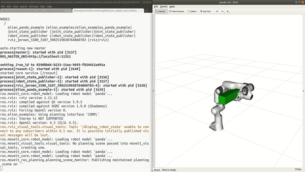

# elion

Constrained planning in MoveIt using OMPL's constrained planning interface

Refactored version of: [https://github.com/JeroenDM/moveit_constrained_planning_plugin](https://github.com/JeroenDM/moveit_constrained_planning_plugin)

Work in progress. The instructions in this readme are valid for the `stable` branch. The branch `devel` constains ongoing work not described here, but discussed in the [GSoC thread](https://github.com/ros-planning/moveit/issues/2092).

## Build instructions

Start with the usual commands:
```bash
mkdir -p catkin_ws/src
cd catkin_ws/src
git clone https://github.com/JeroenDM/elion.git
rosdep install --from-paths . --ignore-src
cd ..
```

At the moment I'm mostly building in Debug mode:
```bash
catkin config --cmake-args -DCMAKE_BUILD_TYPE=Debug
catkin build
source devel/setup.bash
```

## Run examples
With the build explained above complete, you can run the panda example:
```bash
roslaunch elion_examples panda_example.launch 
```
Now Rviz should come up and the script will start executing two planning requests. One with position constraints and one with orientation constraints.



## Run tests
Build the workspace again with the tests argument added.
```
catkin build --make-args tests
```

`elion_planner` has a rostest that initialized different constriants for the panda robot:
```bash
rostest elion_planner test_constraints_panda.rostest
```

Some basic tests exist to check the conversion of an angular velocity vector to roll, pitch, way velocity. I like to run this test directly from the target in the devel space to get readable output.
```bash
./devel/lib/elion_planner/test_elion_conversions
```


